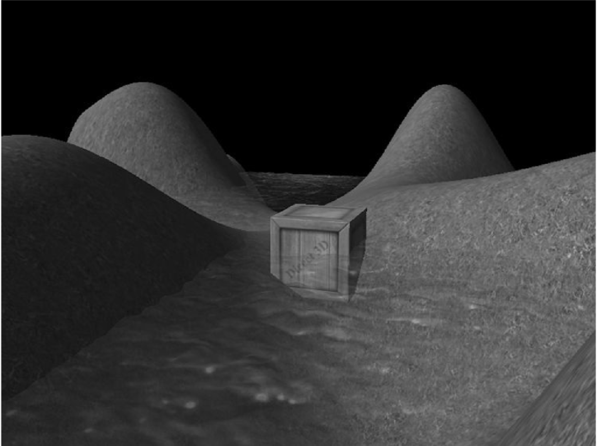

# Chapter10 Blending

观察下方图片[10.1](Images/10.1.png)。
我们在这一帧中最开始渲染的是地形和木箱，因此地形和木箱的像素就被储存在后台缓冲中。
然后我们使用混合技术来绘制一个水面到后台缓冲，因此水的像素和地形以及木箱的像素在后台缓冲中得到了混合，看起来就是木箱和地形穿过了水面。
在本章中，我们尝试混合技术，这个技术能够就是混合(组合)现在正在光栅化的像素(我们称之为源)和之前已经完成光栅化并存储在后台缓冲中的像素(我们称之为目标)。
这个技术能够让我们去渲染透明的物体，例如水和玻璃。




**目标**

- 理解如何使用混合，并且能够在`Direct3D`中使用它。
- 学习`Direct3D`支持的不同的混合模式。
- 发现如何通过使用Alpha去控制图元的透明度。
- 学习如何使用HLSL中的Clip函数阻止一个像素绘制到后台缓冲中。

## 10.1 THE BLENDING EQUATION

我们设**C<sub>src**</sub>表示从我们的像素着色器(**PixelShader**)输出的第**i**,**j**个像素，也就是我们正在光栅化的像素，然后我们设**C<sub>dst**</sub>表示现在在后台缓冲中第**i**,**j**个像素。
如果不使用混合技术的话，像素**C<sub>src**</sub>将会替代**C<sub>dst**</sub>(前提是他能够通过深度和模板测试)。
但是在使用混合的情况下，**C<sub>src**</sub>和**C<sub>dst**</sub>将会混合成一个新的颜色**C**，并且**C**将会替代**C<sub>dst**</sub>作为后台缓冲里面的像素(你可以认为新的颜色**C**将会被写入到后台缓冲中去)。
`Direct3D`使用下面的这个方程来混合源和目标像素的颜色:

**<center>C = C<sub>src</sub> × F<sub>src</sub> ^ C<sub>dst</sub> × F<sub>dst</sub></center>**

F将会在下面介绍，主要是通过F来让我们有更多的方式去实现更多的效果。
`×` 符合表示的是向量的点积，`^`(他那个符合我打不出，我们暂且叫做混合操作)符号是一种由我们自主定义的运算，具体下面会介绍。

上面的方程是用于处理颜色分量中的**RGB**的，对于**Alpha**值我们单独使用下面的方程处理，这个方程和上面的是极为相似的：

**<center>A = A<sub>src</sub>F<sub>src</sub> ^ A<sub>dst</sub>F<sub>dst</sub></center>**

这个方程基本上是一样的，但是这样分开处理的话就可以让`^`运算可以不同了。我们将RGB和Alpha分开处理的动机就是让我们能够单独处理RGB和Alpha值，而两者不互相影响。


## 10.2 BLEND OPERATIONTS

- `D3D12_BLEND_OP_ADD`: **C = C<sub>src</sub> × F<sub>src</sub> + C<sub>dst</sub> × F<sub>dst</sub>**
- `D3D12_BLEND_OP_SUBTRACT`: **C = C<sub>dst</sub> × F<sub>dst</sub> - C<sub>src</sub> × F<sub>src</sub>**
- `D3D12_BLEND_OP_REV_SUBTRACT`: **C = C<sub>src</sub> × F<sub>src</sub> - C<sub>dst</sub> × F<sub>dst</sub>** 
- `D3D12_BLEND_OP_MIN`: **C = min(C<sub>src</sub>, C<sub>dst</sub>)**
- `D3D12_BLEND_OP_MAX`: **C = max(C<sub>src</sub>, C<sub>dst</sub>)**

Alpha的混合操作也是一样的。
当然你可以使用不同的操作来分别处理RGB和Alpha的混合。
举个例子来说，你可以在RGB的混合中使用`+`，然后在Alpha的混合中使用`-`。

**<center>C = C<sub>src</sub> × F<sub>src</sub> + C<sub>dst</sub> × F<sub>dst</sub></center>** 

**<center>A = A<sub>dst</sub>F<sub>dst</sub> - A<sub>src</sub>F<sub>src</sub></center>**


最近在`Direct3D`中加入了一个新的特征(`D3D12_LOGIC_OP`)，我们可以使用逻辑运算符来代替上面的混合操作。
具体的我就没必要放进去了，毕竟很简单理解。

但是你需要注意的是，如果你使用逻辑运算符代替混合操作，你需要注意的是逻辑运算符和传统运算符是不能同时使用的，你必须在这两种里面选择一种使用。
并且你使用逻辑运算符的话，你需要确保你的`Render Target`的格式支持(支持的格式应当是`UINT`的变种)。
## 10.3 BLEND FACTORS

通过改变`Factors(因素)`，我们可以设置更多的不同的混合组合，从而来实现更多的不同的效果。
我们将会在下面解释一些混合组合，但是你还是要去体验一下他们的效果，从而能够有一个概念。
下面将会介绍一些基础的`Factors`。你可以去看SDK文档里面的`D3D12_BLEND`枚举了解到更多高级的`Factors`。
我们设**C<sub>src</sub> = (r<sub>src</sub>, g<sub>src</sub>, b<sub>src</sub>)**，**A<sub>src</sub> = a<sub>src</sub>**(这个RGBA值是由像素着色器输出的)，
**C<sub>dst</sub> = (r<sub>dst</sub>, g<sub>dst</sub>, b<sub>dst</sub>)**，**A<sub>dst</sub> = a<sub>dst</sub>**(这个RGBA值是存储在后台缓冲中的)。

- `D3D12_BLEND_ZERO`: **F = (0, 0, 0, 0)**
- `D3D12_BLEND_ONE`: **F = (1, 1, 1, 1)**
- `D3D12_BLEND_SRC_COLOR`: **F = (r<sub>src</sub>, g<sub>src</sub>, b<sub>src</sub>)**
- `D3D12_BLEND_INV_SRC_COLOR`: **F<sub>src</sub> = (1 - r<sub>src</sub>, 1 - g<sub>src</sub>, 1 - b<sub>src</sub>)**
- `D3D12_BLEND_SRC_ALPHA`: **F = (a<sub>src</sub>, a<sub>src</sub>, a<sub>src</sub>, a<sub>src</sub>)**
- `D3D12_BLEND_INV_SRC_ALPHA`: **F = (1 - a<sub>src</sub>, 1 - a<sub>src</sub>, 1 - a<sub>src</sub>, 1 - a<sub>src</sub>)**
- `D3D12_BLEND_DEST_ALPHA`: **F = (a<sub>dst</sub>, a<sub>dst</sub>, a<sub>dst</sub>, a<sub>dst</sub>)**
- `D3D12_BLEND_INV_DEST_ALPHA`: **F = (1 - a<sub>dst</sub>,1 - a<sub>dst</sub>, 1 - a<sub>dst</sub>, 1 - a<sub>dst</sub>)**
- `D3D12_BLEND_DEST_COLOR`: **F = (a<sub>dst</sub>, a<sub>dst</sub>, a<sub>dst</sub>)**
- `D3D12_BLEND_INV_DEST_COLOR`: **F = (1 - a<sub>dst</sub>, 1 - a<sub>dst</sub>, 1 - a<sub>dst</sub>)**
- `D3D12_BLEND_SRC_ALPHA_SAT`: **F = (a'<sub>src</sub>, a'<sub>src</sub>, a'<sub>src</sub>, a'<sub>src</sub>), a'<sub>src</sub> = clamp(a<sub>src</sub>, 0, 1)**
- `D3D12_BLEND_BLEND_FACTOR`: **F = (r, g, b, a)**

最后一个枚举类型中的参数 **(r ,g ,b ,a)** 通过下面这个函数设置。

`ID3D12GraphicsCommandList::OMSetBlendFactor`

参数是一个`Float[4]`，表示4个分量的值，如果设置为`nullptr`那么就默认全是1。

## 10.4 BLEND STATE

我们已经讨论过了混合操作符和混合因素，但是我们如何在`Direct3D`里面设置这些参数呢？
和其他的`Direct3D`的状态一样，混合状态也是`PSO(渲染管道)`的一个部分。
之前我们使用的都是默认的混合状态(禁用状态)。

我们如果要使用非默认的混合状态，我们必须填充`D3D12_BLEND_DESC`结构。

```C++
    struct D3D12_BLEND_DESC{
        bool AlphaToCoverageEnable; // false
        bool IndependentBlendEnable; // false
        D3D11_RENDER_TARGET_BLEND_DESC RenderTarget[8];
    };
```

- `AlphaToCoverageEnable`:设置成`true`开启`alpha-to-coverage`技术，这个技术是多重采样技术在渲染某些纹理 **(这里的翻译无法保证正确性，因此就使用某些纹理代替)** 的时候使用的。设置成`false`来关闭这个技术。`alpha-to-coverage`技术需要多重采样开启才能使用(换言之就是必须在创建后台缓冲和深度缓冲的时候开启多重采样)。

- `IndependentBlendEnable`:`Direct3D`最多支持同时渲染8个`Render Target`。如果这个属性设置成`true`，那么就可以在渲染不同的`Render Target`的时候使用不同的混合参数(例如混合因素，混合操作符，混合是否开启等)。如果设置成`false`，那么所有的`Render Target`就会使用同样的混合方法(具体来说就是`D3D12_BLEND_DESC::RenderTarget`中的第一个元素作为所有的`Render Target`使用的混合方法)。对于现在来说，我们一次只使用一个`Render Target`。

- `RenderTarget`:第i个元素描述第i个`Render Target`使用的混合方法，如果`IndependentBlendEnable`设置成`false`，那么所有的`Render Target`就全部使用`RenderTarget[0]`这个混合方法去进行混合。


`D3D12_RENDER_TARGET_BLEND_DESC`结构如下所示:

```C++
    struct D3D12_RENDER_TARGET_BLEND_DESC{
        bool BlendEnable; // false
        bool LogicOpEnable; // false
        D3D12_BLEND SrcBlend; // D3D12_BLEND_ONE
        D3D12_BLEND DestBlend; // D3D12_BLEND_ZERO
        D3D12_BLEND_OP BlendOp; // D3D12_BLEND_OP_ADD
        D3D12_BLEND SrcBlendAlpha; // D3D12_BLEND_ONE
        D3D12_BLEND DestBlendAlpha; // D3D12_BLEND_ZERO
        D3D12_BLEND_OP BlendOpAlpha // D3D12_BLEND_OP_ADD
        D3D12_LOGIC_OP LogicOp; // D3D12_LOGIC_OP_NOOP
        UINT8 RenderTargetWriteMask; // D3D12_COLOR_WRITE_ENABLE_ALL
    };
```

- `BlendEnable`: 设置成`true`就开启混合否则就是关闭，注意的是`LogicOpEnable`和`BlendEnable`不能同时开启，你必须使用其中的一个来进行混合。
- `LogicOpEnable`: 设置成`true`就开启使用逻辑运算符的混合，然后和`BlendEnable`不能同时使用。
- `SrcBlend`: **RGB**混合中的**F<sub>src</sub>**。
- `DestBlend`:  **RGB**混合中的**F<sub>dst</sub>**。
- `BlendOp`: **RGB**混合中使用的操作符。
- `SrcBlendAlpha`: **Alpha**混合中的**F<sub>src</sub>**。
- `DestBlendAlpha`: **Alpha**混合中的**F<sub>dst</sub>**。
- `BlendOpAlpha`: **Alpha**混合中使用的操作符。
- `LogicOp`: 混合中使用的逻辑运算符。
- `RenderTargetWriteMask`: 用于控制混合结束后哪些颜色(**R,G,B,A**)可以写入到后台缓冲中去。举个例子来说就是如果我们想禁止将**RGB**写入到后台缓冲中去的话，我们就可以设置成`D3D12_COLOR_WRITE_ENABLE_ALPHA`。如果混合是关闭的，那么就没有任何限制输出到后台缓冲中去。

**Notice:** 由于混合需要处理每一个像素，所以他的开销很大。你最好只在需要的时候才打开它。

## 10.5 EXAMPLES

在这个部分，我们看一些混合操作的特效例子。当然我们只看关于**RGB**混合的例子。

### 10.5.1 No Color Write

如果我们只是想单纯的留下目标像素，即源像素不会和目标像素进行混合以及覆盖，那么就可以使用这个方法。
举个例子来说就是，将目标像素输出到`Depth/Stencil Buffer`中去。方程在下面：

**<center>C = C<sub>src</sub> × (0, 0, 0) + C<sub>dst</sub> × (1, 1, 1)</center>**

**<center>C = C<sub>dst</sub></center>**

另外一个方法就是将`RenderTargetWriteMask`设置成0。
这样的话就禁止了所有的颜色输出到`Back Buffer`中。


### 10.5.2 Adding/Subtracting


如果我们想将源像素和目标像素加起来(参见[10.2](Images/10.2.png))。方程如下：

**<center>C = C<sub>src</sub> × (1, 1, 1) + C<sub>dst</sub> × (1, 1, 1)</center>**

**<center>C = C<sub>src</sub> + C<sub>dst</sub></center>**


我们当然也可以相减啊(参见[10.3](Images/10.3.png))。方程如下：

**<center>C = C<sub>src</sub> × (1, 1, 1) - C<sub>dst</sub> × (1, 1, 1)</center>**

**<center>C = C<sub>src</sub> + C<sub>dst</sub></center>**

### 10.5.3 Multiplying


如果我们想将源像素和目标像素相乘(参见[10.4](Images/10.4.png))。方程如下：

**<center>C = C<sub>src</sub> × (0, 0, 0) - C<sub>dst</sub> × C<sub>src</sub></center>**

**<center>C = C<sub>src</sub> + C<sub>dst</sub></center>**

### 10.5.3 Transparency

现在我们假设**Alpha**分量用来控制源像素的不透明度(0就是**0%**,0.4就是**40%**)。
我们设不透明度为**A**，透明度为**T**。那么透明度和不透明度的关系就是**T = 1 - A**。
比如不透明度是0.4,那么透明度就是0.6。现在我们想将源像素和目标像素在保留源像素的不透明度的情况下，将目标像素透明。方程如下：

**<center>C = C<sub>src</sub> × (a<sub>src</sub>, a<sub>src</sub>, a<sub>src</sub>) - C<sub>dst</sub> × (1 - a<sub>src</sub>, 1 - a<sub>src</sub>, 1 - a<sub>src</sub>)</center>**

**<center>C = a<sub>src</sub> × C<sub>src</sub> + (1 - a<sub>src</sub>) × C<sub>dst</sub></center>**

举个例子就是，我们假设**a<sub>src</sub> = 0.25**，就是不透明度为**25%**。
当源像素和目标像素混合的时候，我们希望保留 **25%** 的源像素，**75%** 的目标像素(这里目标像素在源像素的前面，其实就是说决定目标像素的物体在决定源像素的物体前面)。方程如下：

**<center>C = C<sub>src</sub> × (a<sub>src</sub>, a<sub>src</sub>, a<sub>src</sub>) - C<sub>dst</sub> × (1 - a<sub>src</sub>, 1 - a<sub>src</sub>, 1 - a<sub>src</sub>)</center>**

**<center>C = 0.25 × C<sub>src</sub> + 0.75 × C<sub>dst</sub></center>**

通过使用混合的方法，我们就可以绘制如[10.1](Images/10.1.png)的物体了。这里你就需要在混合的时候注意一些东西，否则你就会绘制的时候出现问题。
我们必须遵守如下规则：

首先绘制那些不需要混合的物体。
然后将需要混合的物体按照他们和摄像机的距离排序。
然后按照从后往前的顺序绘制物体。

从后往前绘制物体的原因我不晓得如何用中文描述了，这个我觉得很显然啊。所以下面是我的**BB**：

对于一个物体来说，我们要将他进行混合的话，我们保留的是后面的像素，因此我们需要先绘制保留的像素，然后在绘制其他的像素。

对于**10.5.1**，绘制的顺序已经没有意义了，反正不会输出。对于**10.5.2**和**10.5.3**我们仍然先绘制不需要混合的物体，然后绘制需要混合的物体。
这是因为我们需要在开始混合之前将所有的不进行混合的像素确定下来。在这里我们并不需要排序需要混合的物体。因为这个运算符是满足交换律的。我们设源像素为**B**。

**<center>B' = B + C<sub>0</sub> + ... + C<sub>n-1</sub></center>**

**<center>B' = B - C<sub>0</sub> + ... - C<sub>n-1</sub></center>**

**<center>B' = B ^ C<sub>0</sub> + ... ^ C<sub>n-1</sub></center>**

### 10.5.5 Blending and the Depth Buffer

当我们进行前面说的几种混合(不包括第一种)的时候，在深度测试的时候可能会有一点问题。
这里我们以加法混合作为例子，其他的混合是差不多的思路。

日狗了，原文说了那么多其实就是想告诉你如果你开启了深度测试的话，你不按照从后往前的顺序绘制的话，那么就可能有像素因为深度缓冲而丢弃，从而没有累加到混合的方程中去，导致最后的颜色有点小问题。
因此我就不直接翻译原文了(原文里面有一部分单词语法没理解，我英语是个渣，但是意思是这个意思没错)。


